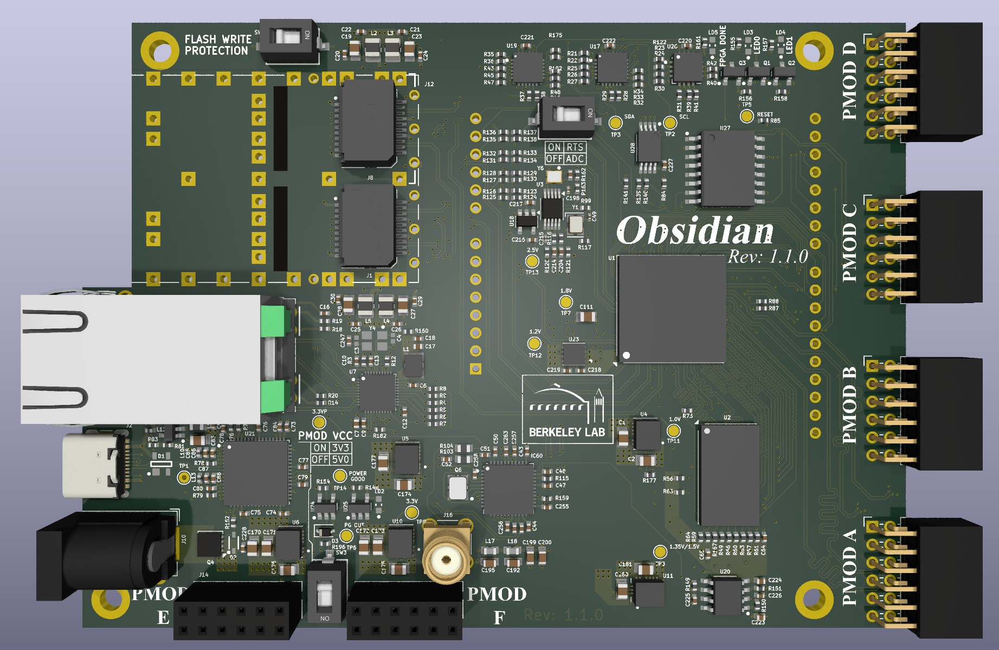

# Obsidian

## Description

Obsidian is a FPGA carrier board in development, designed to interface with ADC and DAC devices,
either stand-alone or as an I/O expansion board for [Marble](https://github.com/BerkeleyLab/Marble).

The design files here were created with [KiCad](https://www.kicad.org/) version 9.0.0-rc3.

## Major Parts

- Xilinx XC7A50T-1CSG325C FPGA

## Credits

## License

---

## Project status

### Included features

- [ ] Arduino shield compatible, like the Digilent Arty
- [ ] SPI flash boot
- [ ] DDR3 memory chip
- [ ] FTDI USB interface
- [ ] 2 direct LEDs
- [ ] 1 GigE port (PoE?)
- [ ] 6 Pmod ports (3.3V)
- [ ] MS5351M or SI5351A or similar for GTP frequency reference
- [ ] USB-C (single USB cable)
- [ ] 4 x SFP
- [ ] I2C or 1-Wire chip for serial number / ROM
- [ ] White Rabbit compatibility

### High speed links

The 7A50T-1CSG325C has 4 x GTP lanes, capable of 3.75 Gbaud.
The primary use-case involves attaching one of those to a Marble over fiber.

The two MGTREFCLK signals are the direct White-Rabbit 125 MHz TCVCXO
and the configurable MS5351M output.

### Wishlist

- [ ] Standardized board size for good case options: Mini-ATX (150 x 150 mm)? Pico-ATX?

### User I/O Pins
- 48 pins for 6 x Pmod
- 49 pins for DDR3 (equivalent to Arty and Marble-Mini)
- 13 pins for RGMII (including reset pin)
- 2 Ethernet PHY MDIO
- 4 pins for White Rabbit DAC (can attach LEDs to 2 x SYNC pins?)
- 1 or more clock input (not counting MGTREFCLK)
- 2 pins for I2C
- 14 pins for Arduino digital IO
- 8 pins for Arduino 4 analog channels
- 2 pins USB UART
- 3 pins SPI flash boot (not counting CCLK in bank 0)

total 146 so far, out of 150 possible with 7A50T-1CSG325C

## Copyright

Obsidian A35 Copyright (c) 2025, The Regents of the University of California, through Lawrence Berkeley National Laboratory (subject to receipt of any required approvals from the U.S. Department of Energy). All rights reserved.

This documentation describes Obsidian A35 and is licensed under the CERN Open Hardware License v 2.0 - Permissive.

NOTICE. This documentation was developed under funding from the U.S. Department of Energy and the U.S. Government consequently retains certain rights. As such, the U.S. Government has been granted for itself and others acting on its behalf a paid-up, nonexclusive, irrevocable, worldwide license in the documentation to reproduce, distribute copies to the public, prepare derivative works, and perform publicly and display publicly, and to permit others to do so.

You may redistribute and modify this documentation under the terms of the CERN OHL v. 2.0 - Permissive (see [CERN-OHL-P-2.0](https://spdx.org/licenses/CERN-OHL-P-2.0.html) for terms and conditions). THIS DOCUMENTATION IS PROVIDED BY THE COPYRIGHT HOLDERS AND CONTRIBUTORS "AS IS" AND ANY EXPRESS OR IMPLIED WARRANTIES, INCLUDING, BUT NOT LIMITED TO, THE IMPLIED WARRANTIES OF MERCHANTABILITY AND FITNESS FOR A PARTICULAR PURPOSE ARE DISCLAIMED. IN NO EVENT SHALL THE COPYRIGHT OWNER OR CONTRIBUTORS BE LIABLE FOR ANY DIRECT, INDIRECT, INCIDENTAL, SPECIAL, EXEMPLARY, OR CONSEQUENTIAL DAMAGES (INCLUDING, BUT NOT LIMITED TO, PROCUREMENT OF SUBSTITUTE GOODS OR SERVICES; LOSS OF USE, DATA, OR PROFITS; OR BUSINESS INTERRUPTION) HOWEVER CAUSED AND ON ANY THEORY OF LIABILITY, WHETHER IN CONTRACT, STRICT LIABILITY, OR TORT (INCLUDING NEGLIGENCE OR OTHERWISE) ARISING IN ANY WAY OUT OF THE USE OF THIS SOFTWARE, EVEN IF ADVISED OF THE POSSIBILITY OF SUCH DAMAGE. Please see the CERN OHL v. 2.0 for applicable conditions.
