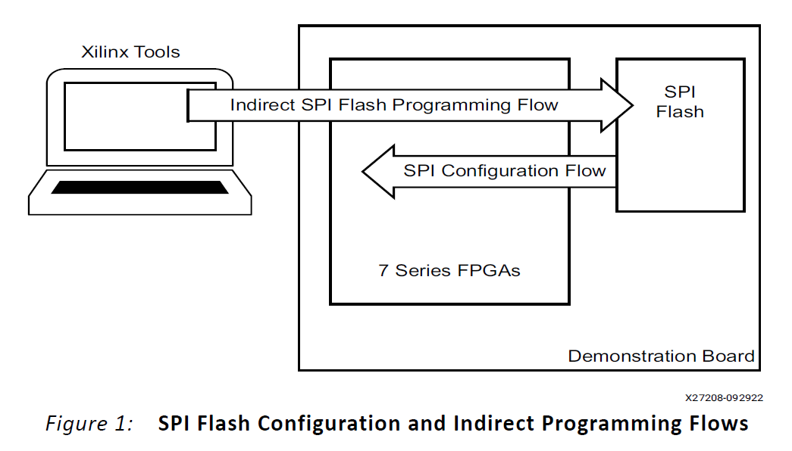
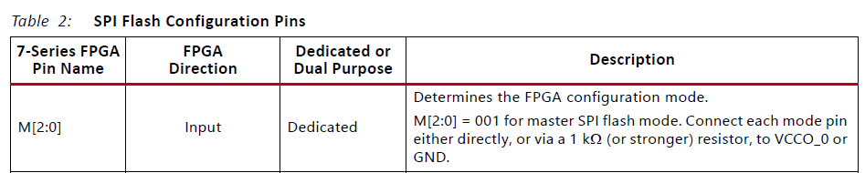
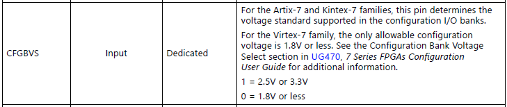
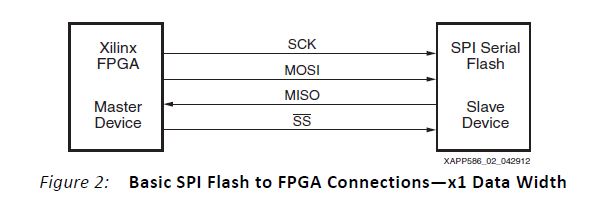
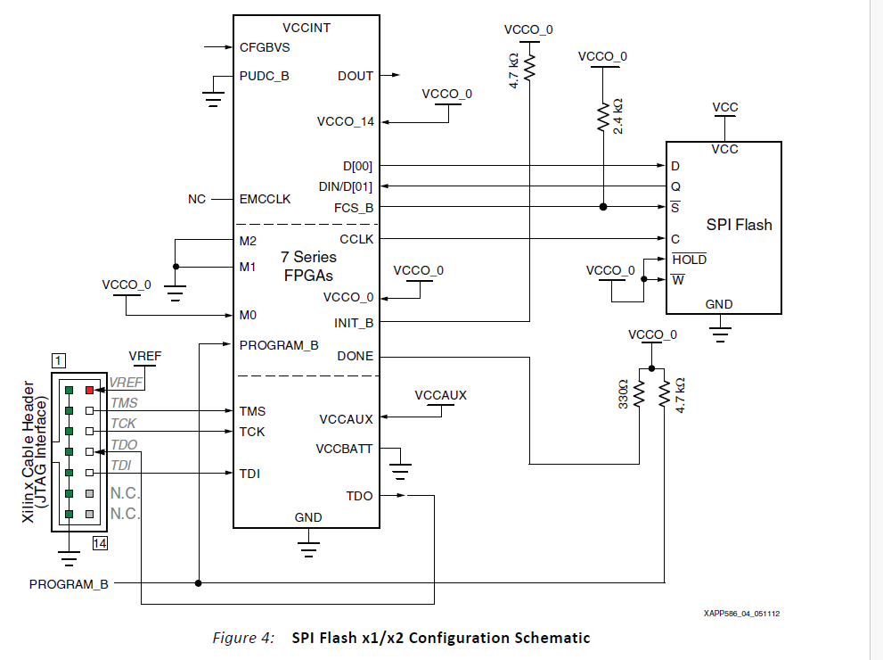

# Flashing protocol

The current flashing method relies on an SPI flash memory used to store the FPGA configuration bitstream. This section is based on the [Xilinx application note XAPP586](Bibliography/Flash_and_debug/xapp586-spi-flash.pdf).

## FPGA configuration

To enable configuration from the SPI flash, the FPGA mode pins `M0`, `M1`, and `M2` must select Master SPI mode:

According to XAPP586, `M[2:0] = 001` selects Master SPI flash mode, so the required setting is `M0 = 1`, `M1 = 0`, and `M2 = 0`. The application note also recommends tying each mode pin directly, or through a `1 kOhm` (or stronger) resistor, to `VCCO_0` or `GND`.

This configuration must match the schematic implementation (`U1E` in `FPGA_DBG`). After FPGA self-initialization, the mode pins are sampled; once `001` is detected, the FPGA starts the Master SPI sequence by driving `CCLK`, asserting `FCS_B`, and sending the flash read command and address on `D[00]`.

There is also the pins in the CFGBVS that needs to be set to a certain level depending on volatge level logic : 

- CFGBVS to 1 if the voltage logic is 3.3V 
- CFGBVS to 0 if the voltage logic is 1.8V

In our case it needs to be 3.3V, so set to 1.

## FPGA connection with flash

The flash can communicate in SPI or QSPI mode, but in this project it is used in standard SPI mode. The [Xilinx application note XAPP586](Bibliography/Flash_and_debug/xapp586-spi-flash.pdf) shows both a simplified connection and the full schematic-level connection:

In x1 mode, the FPGA sends instructions and address on `MOSI`, while the flash returns the configuration data on `MISO`.

| Signal name | FPGA pin | Flash pin | Role in x1 SPI mode |
| --- | --- | --- | --- |
| `MOSI` | `D[00]` | `D`, `DQ0`, `SI`, `IO0` | FPGA output used to send the read instruction and address to the flash |
| `MISO` | `DIN/D[01]` | `Q`, `DQ1`, `SO`, `IO1` | Flash output used to return configuration data to the FPGA |
| `CS` / `SS` | `FCS_B` | `S#` / `CS#` | Active-low slave select driven by the FPGA |
| `SCK` | `CCLK` | `C` | Configuration clock used for SPI transfers |

The FPGA is connected to the computer via a JTAG interface as we can see from the figure 4 above. This JTAG interface is provided by U21 FT2232HQ. 