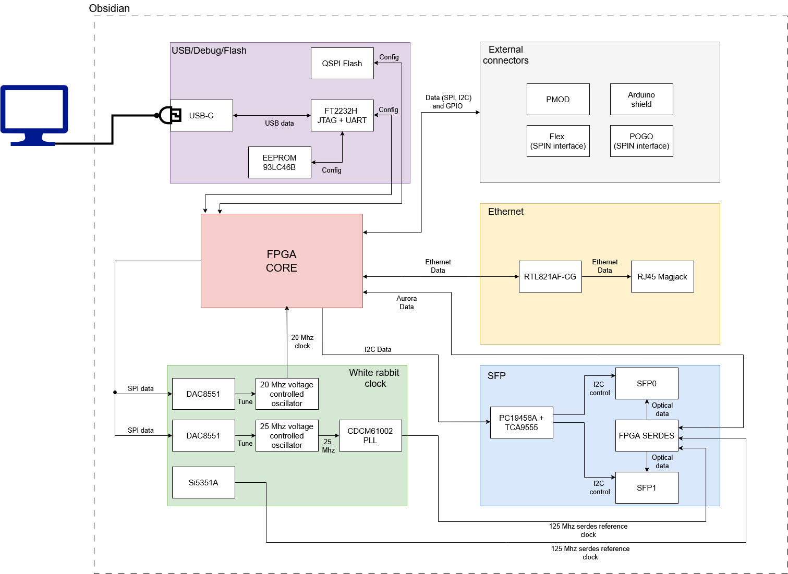

# Obsidian Board General Structure

## Purpose of the board

The Obsidian board is an FPGA-centric digital platform built around a Xilinx Artix-7 XC7A35T-CSG325. It is organized around programmable logic, precision clocking, high-speed serial optical links, copper Ethernet, USB-based bring-up and debug access, and external connexion.

## 1. Top-level architecture

At top level, the board is partitioned into a small number of functional domains:

* FPGA core
* FPGA power and rail distribution
* MGT / SFP optical communication
* Ethernet
* USB debug / configuration / serial
* White Rabbit / clock generation
* External I/O through PMOD, Arduino-style headers, and a dedicated external connectors block with pogo and flex connector for SPIN interface.

## 2. Central role of the FPGA

The FPGA is the structural center of the board. All major functional paths terminate on it:

* the RGMII Ethernet interface
* the GTP transceiver lanes used for SFP optical links
* the QSPI configuration flash
* the USB JTAG and UART debug paths
* the clock-control signals for DAC and I2C-managed timing devices
* the general-purpose external I/O exposed on PMOD and Arduino-compatible connectors

From a system perspective, the FPGA is both the main programmable engine and the main interconnect hub.

## 3. Power structure

The power system is organized as a 12 V input tree followed by several dedicated buck and LDO stages that generate the rails needed by the FPGA core, FPGA auxiliary domains, clocking devices, and external connector domains.

### Main input

The board accepts 12 V input power. The schematic shows a primary 12 V connector and an alternate barrel-jack footprint marked not fitted. The input then feeds the main regulator set and sequencing logic.

### Main rails

The schematic shows these main rails:

* `VCCINT_1V` for FPGA internal core domains
* `MGT_1V` for FPGA MGT power supply
* `+1V8` for FPGA auxiliary domains
* `+1V2` derived for MGT-related supply usage
* `+3V3` for general digital logic and most peripheral circuits
* `+3V3_P` for expansion I/O domains
* `+2V5` for part of the timing section
* `+3V3_USB` generated locally from USB VBUS for the FT2232H domain

## 4. USB, configuration, and debug structure

The USB section is a combined bring-up, debug, and communication interface built around a USB-C connector and an FT2232H USB bridge.

### Functional split

The FT2232H is used in two roles:

* one channel provides JTAG access to the FPGA
* one channel provides a UART serial interface to the FPGA

An external EEPROM is attached to the FT2232H, and the USB block has its own local 3.3 V generation from VBUS.

### FPGA boot path

The FPGA configuration section also includes an onboard QSPI flash connected to the configuration pins, along with the usual configuration-related signals such as `PROGRAM_B`, `INIT_B`, `DONE`, JTAG, and mode straps.

The workflow is:

* onboard QSPI flash as the default nonvolatile configuration source
* USB-JTAG as the debug programming path
* USB-UART as the runtime serial access path

## 5. Optical communication structure

The optical communication path is centered on the FPGA GTP transceiver bank and two SFP channels.

### High-speed path

Functionally, the path is:

FPGA GTP lanes -> MGT transceiver -> SFP modules -> optical fiber

Two transceiver lanes are actively routed to two SFP ports. There is no external retimer, optical PHY, or protocol bridge shown between the FPGA MGT bank and the SFP modules.

### Low-speed control plane

The SFP sheet also contains:

* an I2C switch
* an I/O expander
* standard low-speed SFP control and status signals such as `TX_DISABLE`, `TX_FAULT`, `LOS`, and rate-select-related lines

The optical subsystem is therefore split into:

* a direct FPGA serial data plane
* a managed slow-control plane

This keeps the payload path direct while leaving module management accessible.

## 6. Ethernet structure

The Ethernet section follows a conventional FPGA MAC-side to external PHY architecture. The FPGA interfaces to a Realtek RTL8211F over RGMII, and the PHY connects to an integrated RJ45 plus magnetics connector.

### Functional chain

The chain is:

FPGA -> RGMII -> RTL8211F PHY -> MDI pairs -> magnetics / RJ45

## 7. White Rabbit / clocking structure

The clocking section is one of the main distinguishing blocks of the board. It contains:

* a CDCM61004 clock generator / PLL
* a Si5351A clock generator
* two DAC8550 DACs
* an LM336 precision reference
* a 20 MHz VCXO
* a fitted 25 MHz controlled oscillator path
* filtered and derived supplies dedicated to timing devices

### What this block does structurally

From the schematic connectivity, this clock block does several jobs:

1. generates reference clocks for the FPGA MGT bank
2. generates the 25 MHz Ethernet PHY clock
3. allows DAC-based tuning of oscillator elements
4. feeds selected clocks back into the FPGA fabric

## 8. Concise engineering summary

Overall, Obsidian is a communication FPGA board with:

* an Artix-7 as the main programmable element
* two direct FPGA-to-SFP optical channels
* one copper Gigabit Ethernet interface through an external PHY
* a relatively sophisticated timing and oscillator-control section
* a practical bring-up path through USB-C, FT2232H, JTAG, UART, and QSPI flash

The most distinctive structural feature is the clocking and White Rabbit domain, which makes the board more specialized than a generic Artix-7 development board.
