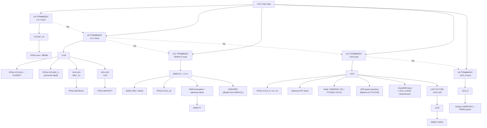

```mermaid
flowchart TD
    VIN["+12V main input"] --> U4["U4 TPSM863257<br/>1.0 V buck"]
    U4 --> VCCINT["VCCINT_1V"]
    VCCINT --> CORE["FPGA core + BRAM"]

    VIN --> U5["U5 TPSM863257<br/>1.8 V buck"]
    U5 --> V18["+1V8"]
    V18 --> AUX["FPGA VCCAUX + VCCBATT"]
    V18 --> ADC["FPGA VCCADC_0<br/>(via ferrite bead)"]
    V18 --> U19["U19 LDO<br/>MGT_1V"]
    U19 --> MGTAVCC["FPGA MGTAVCC"]
    V18 --> U23["U23 LDO<br/>+1V2"]
    U23 --> MGTAVTT["FPGA MGTAVTT"]

    VIN --> U11["U11 TPSM863257<br/>DDRVCC buck"]
    U11 --> DDRVCC["DDRVCC = 1.5 V"]
    DDRVCC --> DDR["DDR3 VDD / VDDQ"]
    DDRVCC --> BANK34["FPGA VCCO_34"]
    DDRVCC --> U20["DDR termination / reference block"]
    U20 --> DDRVTT["DDRVTT"]
    DDRVCC --> DDRVREF["DDRVREF<br/>(divider from DDRVCC)"]

    VIN --> U10["U10 TPSM863257<br/>+3V3 buck"]
    U10 --> V33["+3V3"]
    V33 --> FPGAIO["FPGA VCCO_0 / 14 / 15"]
    V33 --> ETH["Ethernet PHY block"]
    V33 --> PERIPH["Flash / EEPROM / I2C / FT2232H VCCIO"]
    V33 --> SFP["SFP power branches<br/>(filtered VCCT/VCCR)"]
    V33 --> CLK["Clock/WR block<br/>(+3V3_CLEAN downstream)"]
    V33 --> U18["U18 TLV77325<br/>+2V5 LDO"]
    U18 --> V25["+2V5"]
    V25 --> SI5351O["Si5351 VDDO"]

    VIN --> U6["U6 TPSM863257<br/>+3V3_P buck"]
    U6 --> V33P["+3V3_P"]
    V33P --> EXT["Arduino IOREF/3V3 + PMOD power"]

    U4 -. PG .-> U5
    U5 -. PG .-> U10
    U5 -. PG .-> U11
    U10 -. PG .-> U6
```