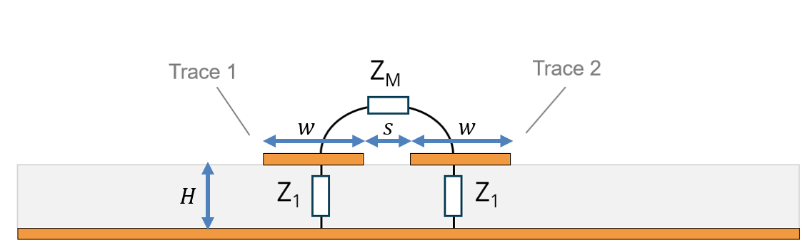
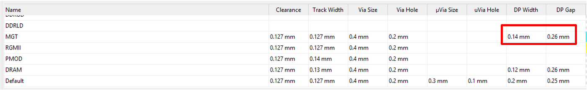
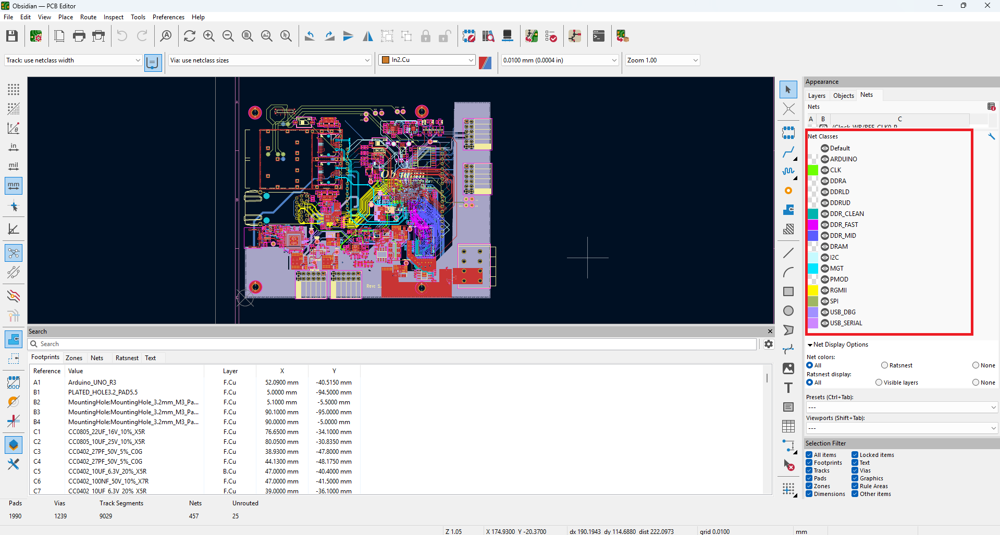

# The stackup of the PCB and sensible signals

## JLCPCB stackup 

The PCB stackup used for this project is JLC08201H-3313 from JLCPCB, you can find on [JLCPCB impedance calculator](https://jlcpcb.com/pcb-impedance-calculator) with the following configuration : 
- Number of layers : 8
- PCB thickness : 2mm
- Inner Copper Weight : 0.5 oz
- Outter Copper Weight : 1 oz
- Unit : mm 

## List of the sensibles signals 

- In priority : 
    - Multi-Gigabyte Transceiver (MGT) : for the optical communication between all the nodes 
    - Clock Signal (in the Clock-WR sheet) : for the synchronization between the nodes
    - SPI signal : Communication between TWIST and Obsidian *
    - I2C signals : Low speed communication to exchange information with SFP module 

- Not a priority : 
    - DDR signals : Communication line between RAM memory and FPGA
    - Ethernet : Communication between FPGA and ethernet PHY

## Impedance matching

For signals such as MGT and clocks, they are differential meaning that the signal is transported in two traces running in parallel. It's important to keep the impedance between the two signals constant in order to avoid reflection of the signal. A 100 Ohm differential impedance is required.

This Impedance is highly dependant on the geometry of the trace : 
- H the thickness of the PCB
- w the widthness of the trace
- s the space between the trace

The variable H depends on the stackup of JLCPCB. For the PCB routing we have to be careful about w and s. 

On the original fork of the project there was already a configuration defined by the user : 

w = 0.14mm 
s = 0.26mm 

After using [JLCPCB impedance calculator](https://jlcpcb.com/pcb-impedance-calculator) we can check that the differential imepdance is around 100 Ohm : 

For single ended signal it gives a 50 Ohm impedance. 

The rules for keeping 100 Ohm (differential) and 50 ohm (single ended) is : 

- w = 0.14mm, s=0.26mm for signals on TOP/BOTTOM of PCB
- w = 0.12mm, s=0.26mm for signals inner to the PCB

Signals that need impedance matching : 

- MGT differential signals going to SFP transceiver : 
    - MGT_TX0_P, MGT_TX0_N, MGT_TX1_P, MGT_TX1_N (See MGT sheet in schematic)
    - MGT_RX0_P, MGT_RX0_N, MGT_RX1_P, MGT_RX1_N (See MGT sheet in schematic)

- MGT differential clock reference : 
    - WR_CLK0_P, WR_CLK0_N, REF_CLK0_P, REF_CLK0_N (see Clock-WR sheet) 

- Single ended clock signals : 
    - CLK_25Mhz (see Clock-WR sheet)
    - CLK20_VCXO (see Clock-WR sheet)
    - CLK2 (see Clock-WR sheet)

- Single ended SPI signals from TWIST to obsidian (see External_Connexion sheet)

## Kicad netclass

To vizualize the sensible signals on the PCB we have defined netclass with color : 

Use them to check that they have continuous ground plane, there is a return ground via for each transition. 